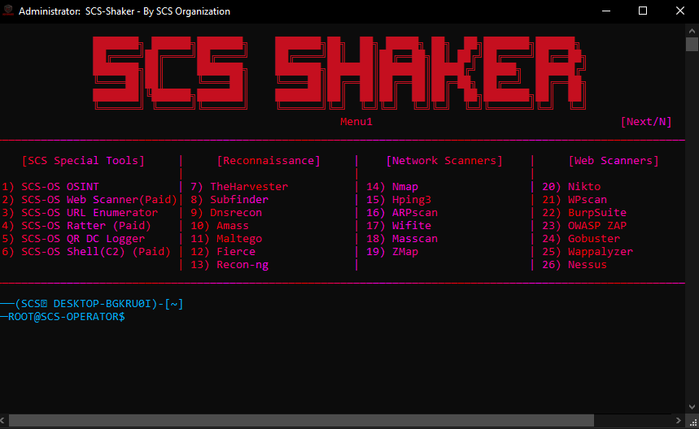
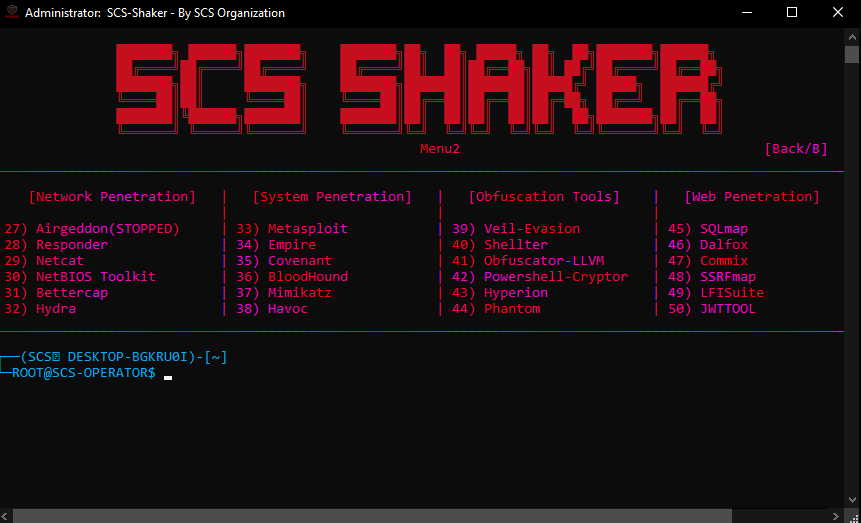

Note: do not forget to setup passwordless sudo and to run Setup.exe and have all tools installed in order to  be able to run this tool.
Note: This tool requires massive CPU & RAM due to multi-tools using at once
Disclaimer: This tool is made for educational purposes and testing security to check if there are any flaws, do not use for illegal.

(Previous SCS Shaker Version 1 Documents removed)

Showcase: -

SCS Shaker Version 2 Documents: -

This time, the tool has been converted: -
from a multi-tool menu into a minimal penetration operating system.

It aims to test security flaws by automation and professional usage of the tools and necessary chosen one to keep it clean.

This is the Demo version of the SCS-Shaker OS, for Version 3 nothing is determined yet, aswell with continous updates to fix bugs found and feedbacks to make it way better.

FEATURES: -
Easy-Usage, User-Friendly, Powerful Automated Tools, Our Automated built-in Tools by our Offensive Security Devs.
Used Python for ease of usage, and represents 90% of all tools out there for Red Teaming. Converted to C by CPython stuff for speedness.

FOR BUILT-IN OUR TOOLS: -

1. SCS-OS OSINT:
Its free automated tool that combines real multi-resources such as shodan waybackmachine theharvester amass dnsrecon so on at once,
aswell automated with profession and used at once with multiple threads, aswell, half parsing may return junk stuff or no outputs due to rate-limiting and scraping options. Not recommended, go to discord.gg/osintkit as better solution, one of most op OSINT Tools out there made by SGA - OSINT Dev/Analyst.

2. SCS-OS Web Scanner:
Its paid fully automated tool that combines real multi-resources for web scanning using multi web scanners and multiple tools at once automated with profession and with multiple threads low parsing used, and enhanced, designed for bug bounty hunting. However, not available yet.

3. SCS-OS URL Enumerator:
Its free tool that looks up for paths inside webs and enumerates it, good for bug hunting however, its more for finding very deep paths that may be useful for bug hunting and overall more for printing out how large a web is.

4. SCS-OS Ratter:
Its paid powerful automated tool that uses Socket for initializing reverse tcp connections with stealer logs in dark webs and powerful stealers and spying options with destroying enemies made for fast enemies-destroying, however, enemies here in the context meant AV, EDR, IDS, IPS, Firewalls so on, to bypass them, and test their security made to fully bypass AV. Fully Educational Purposes only and Security Testing, Usage of this we are not responsible for any action that gets misused or whatever. However, currently unavailable

5. SCS-OS QR Logger:
Its QR Logger tool meant for abusing RA and features of Discord considering at as A04 Insecure Design which Discord ignores, meant for showing how Social Engineering Attacks that phis your token works, and how could you avoid falling for it by not triggering RA (Remote Authentication). For educational purposes only, in the coming paid one, it will include other platforms.

6. SCS-OS Shell (C2):
Very powerful C2 (Command and Control) Center used in Dark Webs that have full control and command over machines compromised fully stealth where no reverse/bind shells used just pure hidden real time injected processes with native windows apis such as ntdll with botnets stuff and logins with tg/dc bots for the c2, copies itself to registeries everywhere and deep paths such as appdata roaming and local so on. It's goal is to test maximum antivirus potential since really no suspicious shells just connections to telegram/discord which are not suspicious, designed for learning how companies compromised and how botnets formed. However, currently unavailable.

Aswell, tools like Subfinder automated to extract subdomains with HTTP Code 200 only with saving them to .txt file inside Output folder and much much more automated.
Some Tools cannot be pinned to taskbar, which are really efficient once they are because you can then directly open them from taskbar through just hitting number of it inside the tool.

Runs System-based Commands and Subsystem-based Commands on CMD Prompt, Powershell, Kali WSL for automation rather than opening them manually, think of it like a collection minimal os of almost all necessary penetration tools you need.

For some automated tools, inside Input folder you have to put specific things such as in ips.txt the ips of targets which you will poison its arps for configurations.

REQUIREMENTS: -

Run Setup.exe as mentioned to install everything, aswell make sure the machine is Windows, currently Linux not supported, aswell make sure Kali WSL installed with apt updated and upgraded fully.
There could be inputs in Input folder, make sure everything is configured.
If anything not working you may send us feedbacks at our academy discord.gg/scshacking
Many tools do work, anything that is f**ked up consult us.

How-to-use-friendly: -

Pin Shaker.exe, Output, Input, SCS to your taskbar so you can directly monitor stuff.